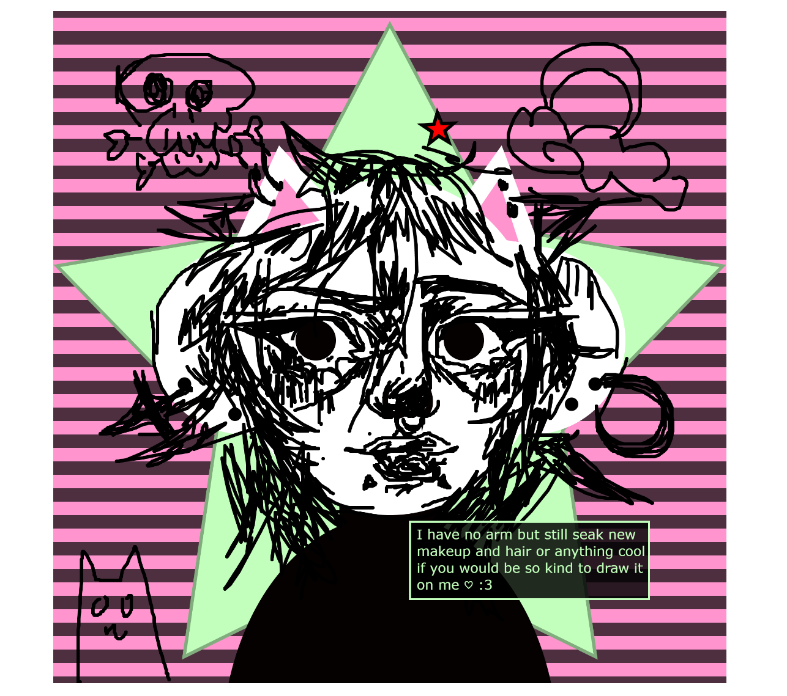
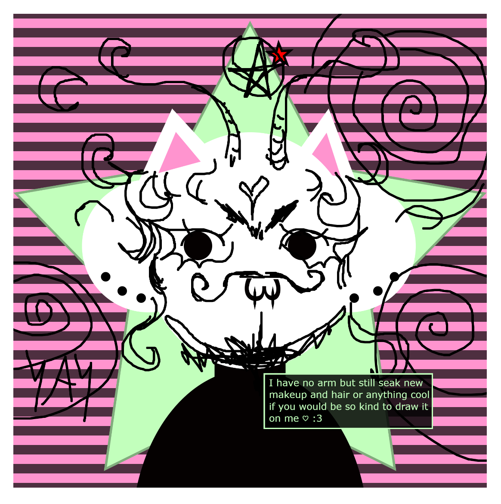
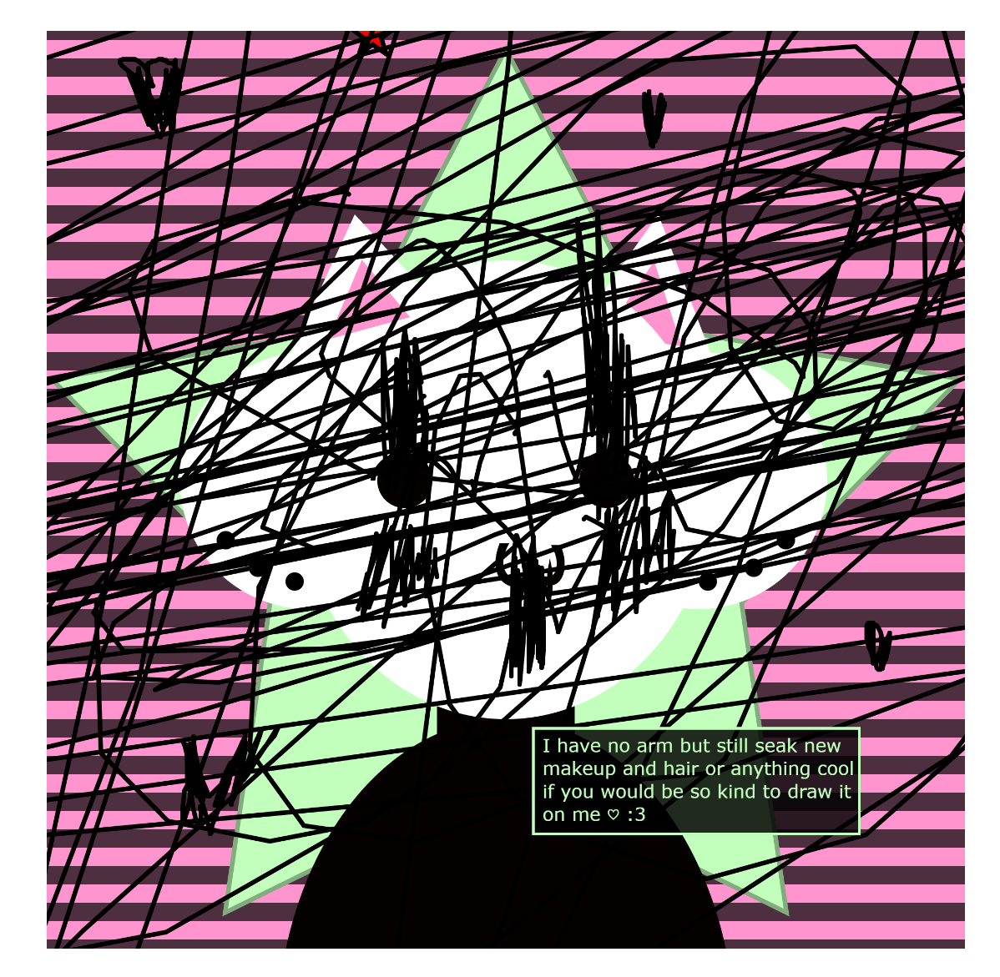

Mini me (without arms)

Ash Oest O'Leary

## Description

Probably an alternate version of me that exist. 
I tried to mixed how I look visually, with the basic human features, my piercing and my online face I make :3, as well as some things I love like cats, stars, lined pattern and the ability to put makeup (eyeliner) and to change it often.

I recommend using the pressed mouse to draw anything creative on my mini me.

## Screenshot(s)

Exemple of what you can do:
HAVE FUN !!

> 
> 
> 

## Attribution

> - This project uses [p5.js](https://p5js.org).
> - used this reference for the star : (https://archive.p5js.org/examples/form-star.html)
## License

> This project is licensed under a Creative Commons Attribution ([CC BY 4.0](https://creativecommons.org/licenses/by/4.0/deed.en)) license with the exception of libraries and other components with their own licenses.