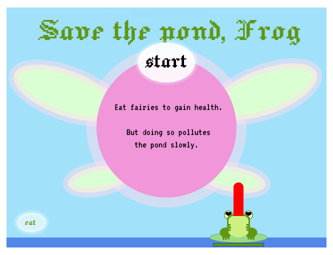
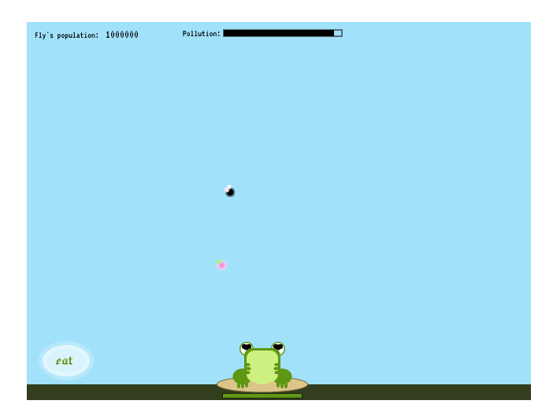
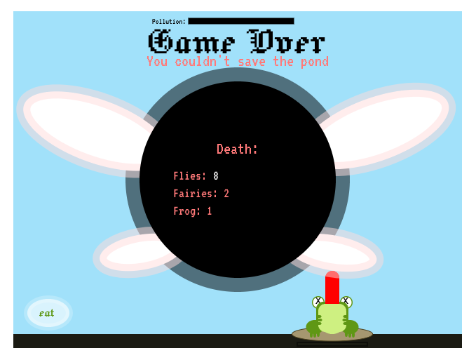

/**
 * Save the world, Forg
 * Ash Oest O'Leary
 * 
 * A game about balancing the ecosystem of your pond as frog when toxic flies are trying to invade it. Luckily there's fairy around to help. 
 * 
 * 
 * Instructions:
 * - Move the frog with your mouse
 * - Click to launch the tongue
 * - Catch flies to keep the pollution low, but be careful because they poison you aswell (slowly)
 * - Catch fairies to heal, but eating them cause a bit of pollution
 * - Keep your health high and pollution low to survive
 * 
## Save the world, Forg

[Play it!](https://mewmewpewpew.github.io/cart253/topics/mod-jam/)

(I plan mostly on paper)
- [Ideas](./ideas.md)
- [Planning](./planning.md)
- [Pseudocode](./pseudocode.md)
- [Brainstorm](./brainstorm.md)

Ash Oest O'Leary

[View this project online](https://mewmewpewpew.github.io/cart253/topics/mod-jam/)

## Description

Save the world, Frog is a game about a frog who's under a lot of pressure. His pond is invaded by invasive toxic flies that threatened his ecosystem. Luckily Frog is hungry and sets a goal to eat all of the flies to protect his home from being polluted. 

One thing thought, is that the flies are also a bit toxic to Frog. He needs to be careful not to poison himself and die. Fairies have healing propreties when eaten, but they are important to the ecosystem and eaten them pollutes aswell. 

Instructions:
Move the frog with your mouse
Click to launch the tongue
Catch flies to keep the pollution low, but be careful because they poison you aswell (slowly)
Catch fairies to heal, but eating them cause a bit of pollution
Keep your health high and pollution low to survive

## Screenshot(s)

This bit should have some images of the program running so that the reader has a sense of what it looks like. 

> 
> 
> 

## Attribution

I used elements learn from Pippin Barr's class, as well as his sketch (https://editor.p5js.org/pippinbarr/sketches/UmfzbWYRt). I used information from flanniganable's youtube video (https://www.youtube.com/watch?v=uHNgkQsHLXQ). 

> - This project uses [p5.js](https://p5js.org).
> - The Music background is called "Touch the sky" by Dazegxd
> - Sound effect "mlem" is from the character Yoshi from Nintento (Mario bros)
> - Sound effect "hey listen" is from te character Navi from Nintendo (Zelda)

## License

> This project is licensed under a Creative Commons Attribution ([CC BY 4.0](https://creativecommons.org/licenses/by/4.0/deed.en)) license with the exception of libraries and other components with their own licenses. I do not claim to own any music or sound effects used.