# *Do you remember?  MEMORY GAMES*

Ash Oest O'Leary

[View this project online](https://mewmewpewpew.github.io/cart253/topics/variation-jam/)

## Description

This is the code for the variation-jam for the CART 253 class. 
I chose to start the project from a memory card game, which it's essence is still present in all variation:  
1. *Base* - 2.*Tarot* - 3. *Sound* 

### *Base* variation
The first variation plays more the role of the base version of this memory card game than a variation of it. 
Still, I made it different by adding my own touch of styling and my art.
- Instruction:
>When clicking a faced down card, reveal 1 of 8 symbol on the card. Try and match this card with another sharing the same symbol. If the 2 cards revealed don't have the same symbol, they are turned down. If a pair of card is found, they stay revealed.To win, one must find the 8 pairs of cards successively.
### *Tarot* variation
The second variation is the most complex of them all. Instead of a symbol on each pair, I was inspired by the tarot cards and chose 8 archetypes of the major arcana of the fool's journey to replace it. The Idea was to combine the two card "games" into one. With my own knowledge and the tarot deck from Aya Takano, I made each archetypes their own prophecies and outcomes. Therefore, the goal is not to pair them all but to pair the archetype you wish to make true for yourself. With this game, I unconscioully asked the user the question if one's fate is determined or not.
 * Instruction:
>When starting the game, text appears: "Select 2 cards, but be careful when pairing them because they will determine your fate... Double-click to start ". When clicking a faced down card, it reveals 1 of the 8 archetypes on the card with a bigger one also appearing on the left and a random related prophecy on the right. Try and match this card with another sharing the same archetype. The goal would be to experience all the different outcomes, rather than trying to win. To win, one must pair either *The sun* card or gamble they success with a 50% chance with the *Fortune* card.

 * Below are all the chosen archetypes in order (of major arcana number), their outcome in the game and meaning in real life: 
>*The magician*, *The lovers*, *The chariot*, *The hermit*, *Fortune*, *Death*, *The Tower* & *The Sun*.

>* If *The magician* is paired: 4 elements are added as images or .gif: a wand, a cup, a sword & a coin/pentacle.
They each represent in tarot: fire & action, water & emotion, air & ideas/rational thinking and earth & harverst/material/money... meaning that *The magician* has all elements required to infinitly create.
>* If *The lovers* is paired: A .gif of 2 hearts spinning are added to the screen. Easy methaphore here: love. The
lovers aren't necessarely about romance, but rewarding & intimate relashionships. 
>* If *The chariot* is paired: The bigger card on the left starts leaving to new horizons (y -= 10). Representing
movement, sometimes impulsive. The vibe of saying yes and go running in search of purpose despite anxieties or obstacles.
>* If *The hermit* is paired: A new prophecy is revealed. It is the image also used in the starting screen for a 
reason. Guidance, clearer instructions are showned: "Listen carefully... As you may have experienced, when you match a pair of tarot cards together, your fate becomes determined by it's meaning... Good luck". *The hermit* represents deep introspection and the knowledge gain by it. They take then the role as guides for others.    
>* If *Fortune* is paired: A wheel of fortune appears with instructions on top: "Your fate is in the hands of *the Wheel of Fortune*", both refering to the original name of this card. *Fortune* can be either good fortune or bad fortune, but it is unstoppable. This gamble of two equal outcomes ends the game either by winning it or losing it. *Fortune* embraces chaos of life by taking action in what you can change. 
>* If *Death* is paired: A cropped and + sized image of the card appears with the text: "Dead end, Click to 
restart". This outcome acts as an anti-pair and restarts the choosing process for the user. The *Death* card is often miss-judged for it's name. As much as it means 
the end of a cycle, it also means the begginning of a new one.
>* If *The Tower* is paired: A cropped and + sized image of the card appears with the text: "You Lost ! :(". It 
also takes aways the images & .gifs of *The lovers* & *The magician* if revealed before. *The tower* is the losing endgame and is represented it by that because it annonces a bad omen. A cycle of self-fulfilling prophecy of destruction caused by denial. The methaphore here is that no matter how you build or try to fix something (like a tower), it is bound to fall if the foundations are wrong.  
>* If *The Sun* is paired: A cropped and + sized image of the card appears with the text: "You Win ! :)". Contrary to *The tower*, it is the winning endgame and is represented by *The sun* because this card means success, joy, fun & abundance. Comparing oneself to the sun's radiance, strengh and freedom or being blessed by it's warmth as a positive interpretation.

**without proper optimization, the program runs a bit slow :(

### *Sound* variation
The third variation changes our senses. This time, the visuals are made different with more industrial and realistic images and styling. The cards are now on & off switch buttons that when clicked instead play 8 various sounds. 
 * Instruction:
 >When clicking a button, hear 1 of 8 sound as the button light up. Try and match this same sounds. If 2 buttons revealed don't have the same sound, they are turned off. If a pair of sounds is found, they stay on.If one finds the 8 pairs of sounds successively, they win. All buttons turn green and a victory sound is heard.

 #### *Music* variation                  
I spend some time trying to add a fourth variation, which is a not completed experiment/continuation of the third variation. would off been the continuation of the sound variation, with nicer loops that, when completed, would produce a full music with it's 8 tracks. I wanted to add a sound visualizer as well :3 I gave up on it, not because it was too hard, but because of time and mental health.

## Screenshot(s)
> 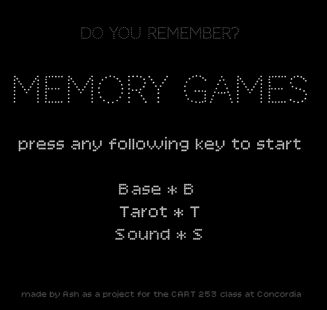
#### *Base* variation
> 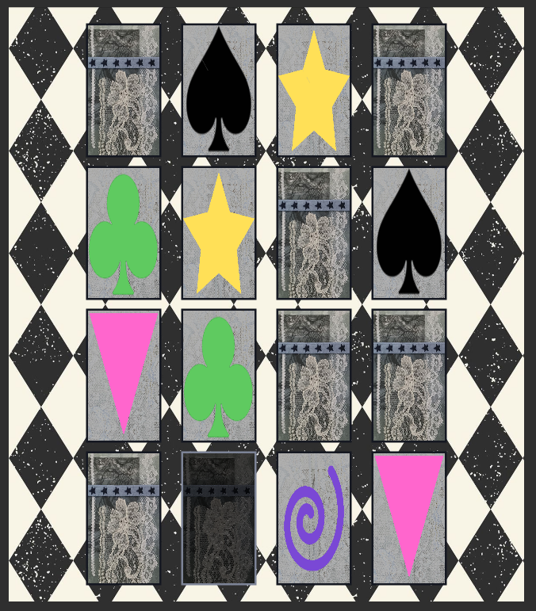
> 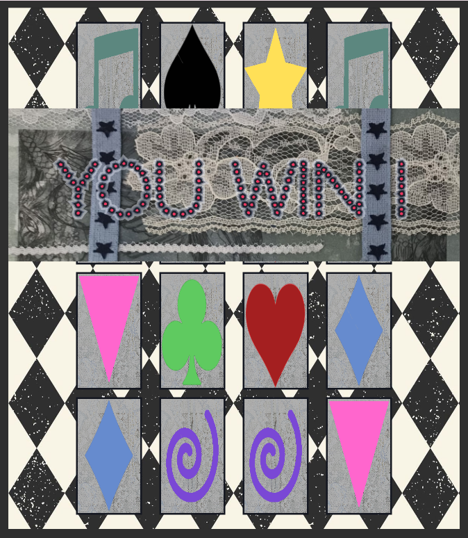

#### *Tarot* variation
> 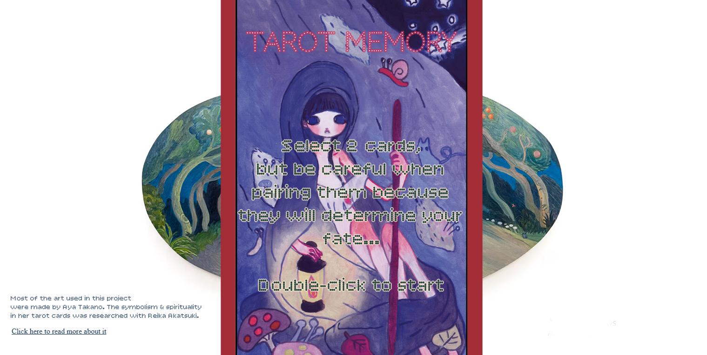
> 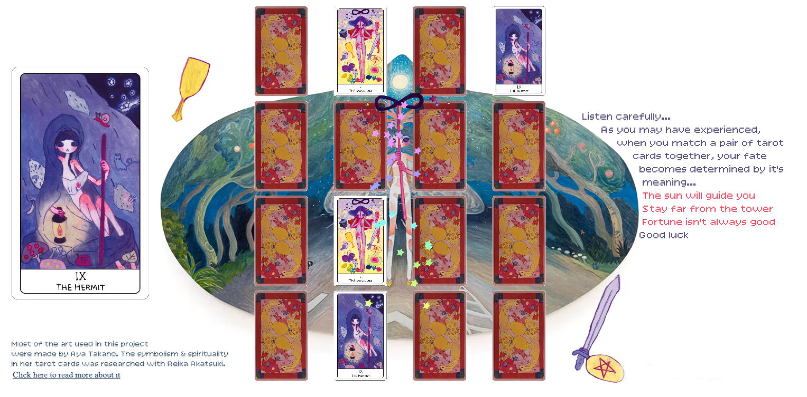 
> 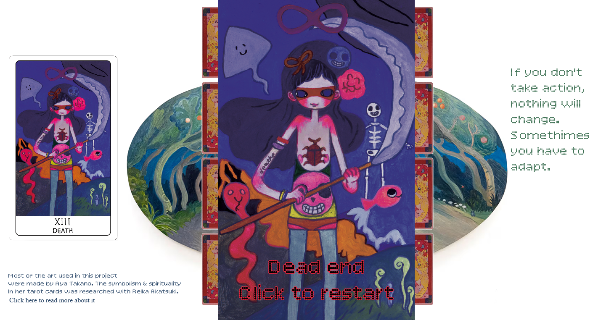
> 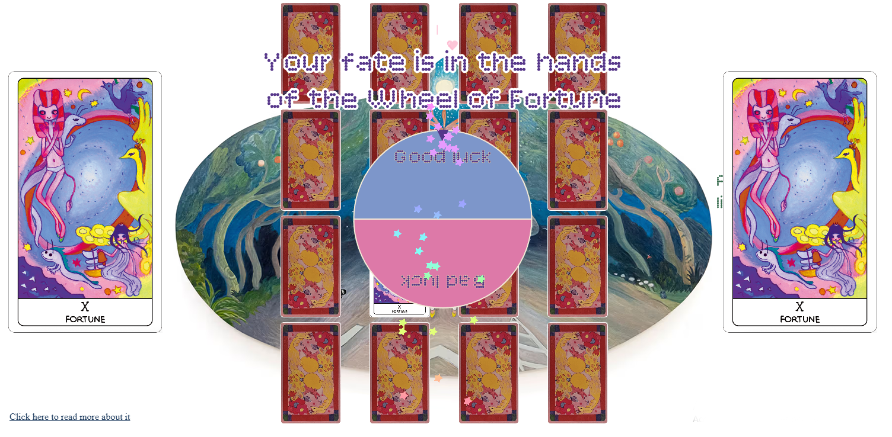
> 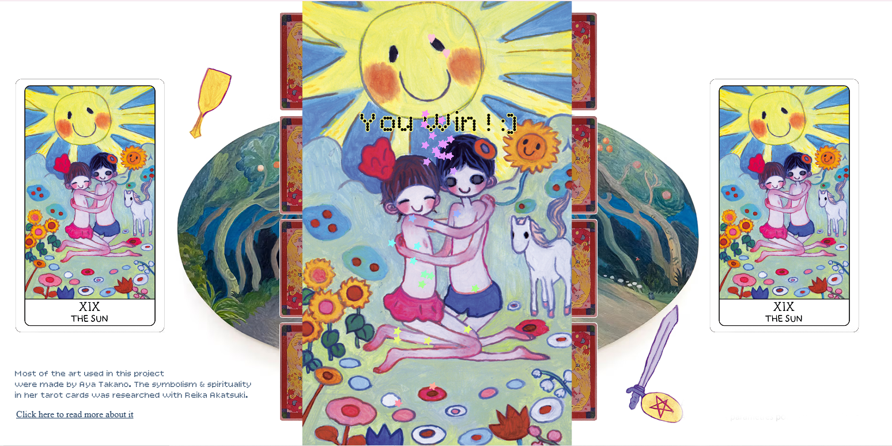
> 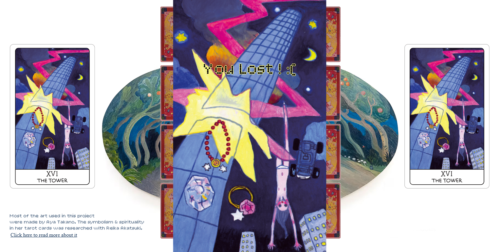
#### *Sound* variation
> 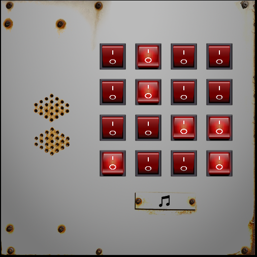
> 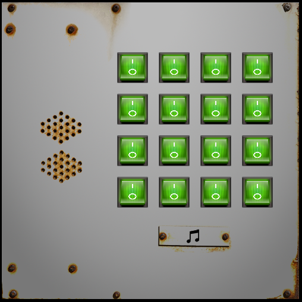
## Attribution
Links of the code copied & adapted + online references I used
- This project uses [p5.js](https://p5js.org).
- starting code for the memory game card: https://editor.p5js.org/smitharaoaluri/sketches/chgs4aavq
- I got the starting point of the menu-variation code from our class teacher Pippin Barr
- html background-color :https://stackoverflow.com/questions/197748/how-do-i-change-the-background-color-with-javascript
- images: https://p5js.org/reference/p5/image/
- Fonts from [Google fonts](https://fonts.google.com/)
    #### Futur uses ?/fun/helpful stuff
- restart button: https://p5js.org/reference/p5.Graphics/reset/
- https://editor.p5js.org/owenroberts/sketches/kQoPj38dj
- https://archive.p5js.org/learn/interactivity.html 
### Base variation
- Mostly used my one edited art :3
### Tarot-variation
- wheel of fortune: https://editor.p5js.org/Q/sketches/07UvXkBLV - https://editor.p5js.org/schellenberg/sketches/_Ers-90T_ 
- shuffle objects: https://stackoverflow.com/questions/2450954/how-to-randomize-shuffle-a-javascript-array 
https://www.w3schools.com/jsref/jsref_includes_array.asp 
- random value from array: https://stackoverflow.com/questions/5915096/get-a-random-item-from-a-javascript-array
- Html elements (Link): https://p5js.org/reference/p5/createA/
https://p5js.org/reference/p5.Element/style/
- gif: https://editor.p5js.org/kjhollen/sketches/S1bVzeF8Z
- classes: https://p5js.org/reference/p5/class/
- Most art elements (background, cards ) were made by Aya Takano. The symbolism & spirituality in her tarot cards was researched with Reika Akatsuki. [Images and link to their tarot original story of the Fool's journey (major arcana)](https://en.gallery-kaikaikiki.com/2021/08/aya-takano-tarot-card/)
    #### Futur uses ?/fun/helpful stuff
- Optimization?: https://github.com/processing/p5.js/wiki/Optimizing-p5.js-Code-for-Performance#identifying-slow-code-profiling
### Sound-variation
- volume: https://p5js.org/reference/p5/outputVolume/ 
- playing a sound once: https://editor.p5js.org/nitrocaphane/sketches/pi1MwuJED
- Gamelan sound origin: https://www.youtube.com/watch?v=HfrOSJRCsfM&t=46s 
- cat sound origin (Minecraft): https://www.youtube.com/watch?v=7pPiI-EHIeI
- other sounds of this variation are from free sample library of a program called [Bandlab](https://www.bandlab.com/) where I mixed/edited it all.
- button images(just used a screenshoot): https://dev.to/ykadosh/how-i-made-this-realistic-red-switch-pure-css-49g2 
- I edited the "winning sound" from the game Plant vs Zombie in my own "winning sound"
    #### Futur uses ? /fun/helpful stuff
- https://medium.spatialpixel.com/sounds-bd05429aba38 
- https://editor.p5js.org/codingtrain/sketches/F0ZnzjvJC 

## Process
Here is my process of this project's [ideas](./process/Ideas.md) & [planning](./process/planning.md)...

## License

> This project is licensed under a Creative Commons Attribution ([CC BY 4.0](https://creativecommons.org/licenses/by/4.0/deed.en)) license with the exception of libraries and other components with their own licenses.

